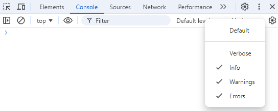

# Obsidian Dev Utils [](https://npmjs.org/package/obsidian-dev-utils)

`Obsidian Dev Utils` is a collection of essential functions and CLI tools designed to streamline your Obsidian plugin development process. Whether you're building a plugin from scratch or enhancing an existing one, these utilities are here to simplify your workflow.

## What is Obsidian?

[Obsidian](https://obsidian.md/) is a powerful knowledge base that works on top of a local folder of plain text Markdown files. It's a tool that lets you take notes and organize them, and it supports a rich plugin ecosystem that allows for extensive customization.

## Who Should Use This Package?

This package is ideal for developers who are building or maintaining plugins for Obsidian. It provides a range of tools to make the development process easier, including automated builds, linting, spellchecking, and more.

## Installation

To install the package, run the following command:

```bash
npm install obsidian-dev-utils
```

## Usage

### CLI Commands

The package offers several CLI commands to facilitate common development tasks:

#### Build Production Version

```bash
npx obsidian-dev-utils build
```

Compiles the production version of your plugin into the `dist/build` folder.

#### Clean build folder

```bash
npx obsidian-dev-utils build:clean
```

Cleans `dist` folder.

#### Build static assets

```bash
npx obsidian-dev-utils build:static
```

Copies `static` folder to `dist` folder.

#### Validate TypeScript build

```bash
npx obsidian-dev-utils build:validate
```

Validates if TypeScript code compiles.

#### Build Development Version

```bash
npx obsidian-dev-utils dev
```

Compiles the development version of your plugin into the `dist/dev` folder. The `OBSIDIAN_CONFIG_DIR` can be set either as an environment variable or specified in a `.env` file (e.g., `path/to/my/vault/.obsidian`). The command automatically copies the compiled plugin to the specified Obsidian configuration directory and triggers the [Hot Reload] plugin, if it is enabled. If the [Hot Reload] plugin is not installed, it will be installed automatically, and you will need to enable it manually.

#### Lint Code

```bash
npx obsidian-dev-utils lint
```

Lints your code, enforcing a code convention to minimize common errors.

#### Lint and Fix Code

```bash
npx obsidian-dev-utils lint:fix
```

Lints your code and automatically applies fixes where possible.

#### Publish

```bash
npx obsidian-dev-utils publish
```

Publishes the package to NPM. Usually not applicable for plugins.

To bypass manual verification, consider setting `NPM_TOKEN` to the environment variable or in your `.env` file.

#### Spellcheck Code

```bash
npx obsidian-dev-utils spellcheck
```

Checks your code for spelling errors.

#### Version Management

```bash
npx obsidian-dev-utils version <versionUpdateType>
```

Runs build checks before updating the version and releases if all checks pass. The `<versionUpdateType>` can be `major`, `minor`, `patch`, `beta`, or a specific version like `x.y.z[-suffix]`.

#### Simplified Usage

To simplify the usage of these commands, you can add them to your `package.json`:

```json
{
  "scripts": {
    "build": "obsidian-dev-utils build",
    "build:clean": "obsidian-dev-utils build:clean",
    "build:static": "obsidian-dev-utils build:static",
    "dev": "obsidian-dev-utils dev",
    "lint": "obsidian-dev-utils lint",
    "lint:fix": "obsidian-dev-utils lint:fix",
    "spellcheck": "obsidian-dev-utils spellcheck",
    "version": "obsidian-dev-utils version"
  },
  "...": "..."
}
```

This setup allows you to run the commands using `npm run`, like `npm run build`.

### Helper Functions

`Obsidian Dev Utils` also provides a range of general-purpose and Obsidian-specific helper functions.

The functions are grouped by files and folders and you have multiple ways to import them:

```typescript
import { prompt } from 'obsidian-dev-utils/obsidian/Modal/Prompt';
await prompt({ app, title: 'Enter your name' });

import { Prompt } from 'obsidian-dev-utils/obsidian/Modal';
await Prompt.prompt({ app, title: 'Enter your name' });

import { Modal } from 'obsidian-dev-utils/obsidian';
await Modal.Prompt.prompt({ app, title: 'Enter your name' });

import { obsidian } from 'obsidian-dev-utils';
await obsidian.Modal.Prompt.prompt({ app, title: 'Enter your name' });

import * as obsidianDevUtils from "obsidian-dev-utils";
await obsidianDevUtils.obsidian.Modal.Prompt.prompt({ app, title: 'Enter your name' });
```

## Styling

The library provides some extensible styles that you can use to style your plugin.

Default styles are defined in [styles.css](https://github.com/mnaoumov/obsidian-dev-utils/blob/main/static/styles.css).

You can override those styles in your plugin's `styles.css` file via adding your plugin's id to the selector, e.g. for plugin `foo-bar`:

```css
.foo-bar.obsidian-dev-utils.plugin-settings-tab .value-component-invalid {
  box-shadow: 0 0 0 2px var(--text-error);
}
```

## Debugging

By default, console debug messages are not shown. To enable them you have to enable `Verbose` mode in the console settings.



When you enable `Verbose` mode, you will see debug messages in the console sent via `console.debug()` calls.

`obsidian-dev-utils` library uses [debug](https://github.com/debug-js/debug) library to enable conditional logging.

By default, none of the debug messages are shown. You have to enable the debug namespace explicitly.

To see debug messages for your plugin `foo-bar`, you have to enable them:

```javascript
window.DEBUG.enable('foo-bar'); // show all debug messages from the `foo-bar` plugin
window.DEBUG.enable('foo-bar:obsidian-dev-utils:*'); // show all debug messages from the `obsidian-dev-utils` library within the `foo-bar` plugin
window.DEBUG.enable('foo-bar:*'); // show all debug messages from the `foo-bar` plugin and its submodules
window.DEBUG.enable('*:obsidian-dev-utils:*'); // show all debug messages for the `obsidian-dev-utils` library within any plugin
window.DEBUG.enable('*'); // show all debug messages
```

See full documentation of [`window.DEBUG`](https://github.com/mnaoumov/obsidian-dev-utils/blob/main/src/DebugController.ts).

> [!NOTE]
>
> You will see `StackTraceFakeError` in the debug messages. They are not actual errors. It's just a workaround to make stack trace links clickable.

## Support

<a href="https://www.buymeacoffee.com/mnaoumov" target="_blank"></a>

## License

© [Michael Naumov](https://github.com/mnaoumov/)

[Hot Reload]: https://github.com/pjeby/hot-reload
